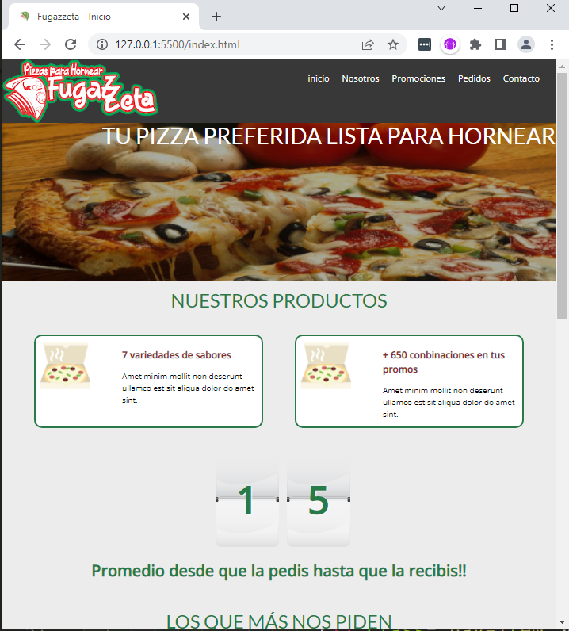
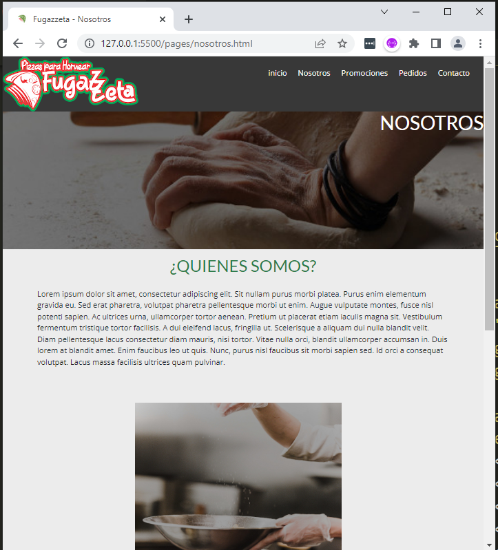
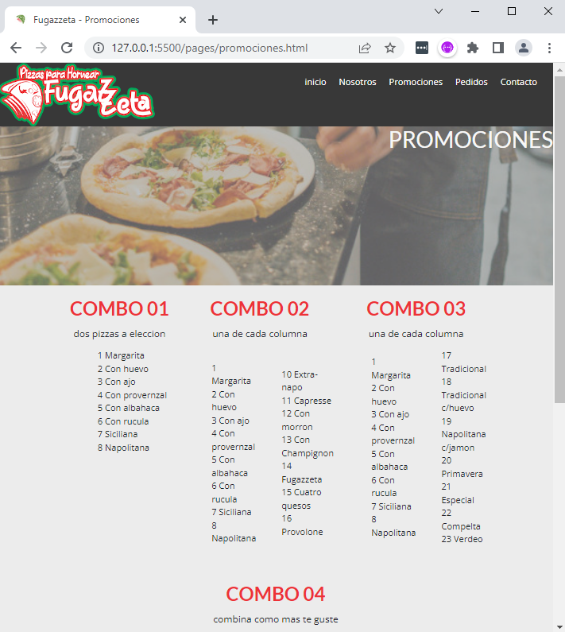
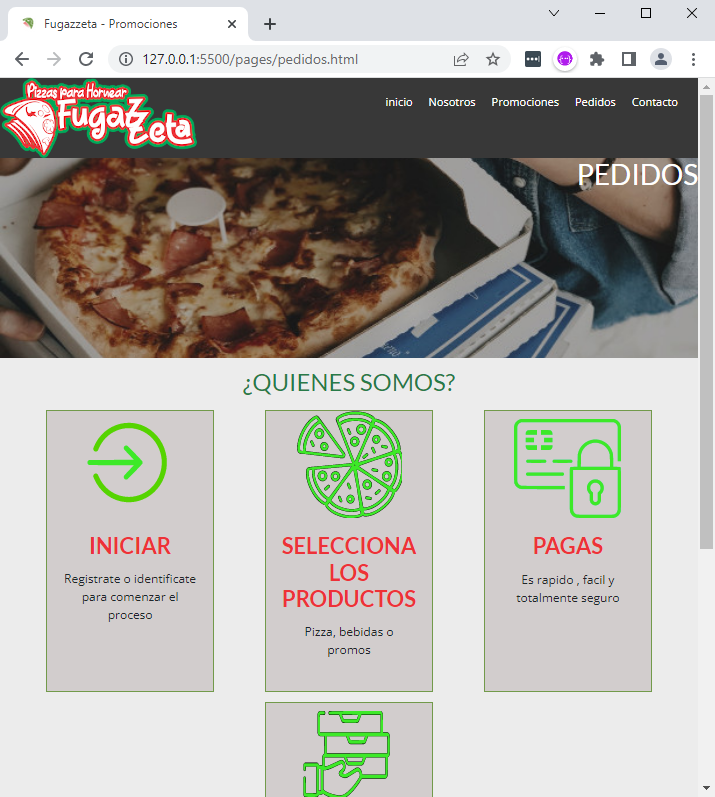
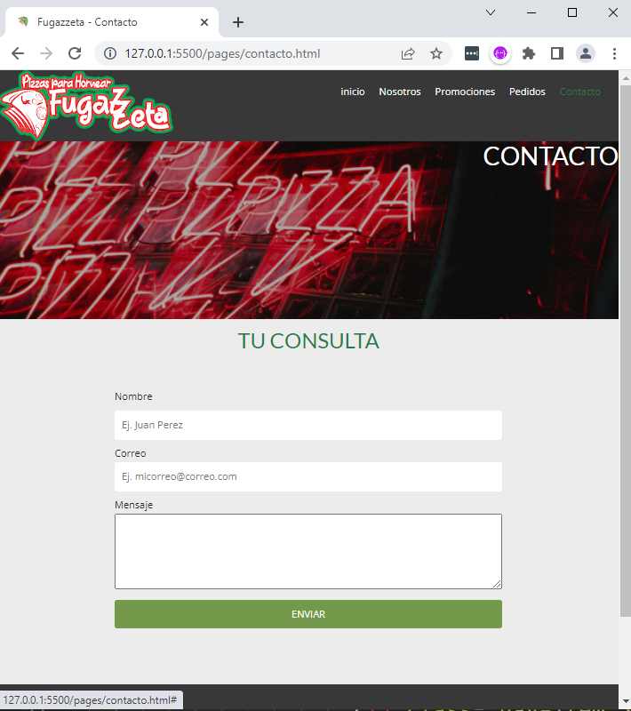

   

 

### Tópicos 

- [Descripción del Proyecto](#descripción-del-proyecto)

- [Funcionalidades](#funcionalidades)

- [Herramioentas Utilizadas](#herrramientas-utilizadas)

 

## Descripción del Proyecto

 

 Este proyecto tiene como objetivo aplicar los conocimientos obtenidos en el curso de desarrollo Web de CoderHouse.
 El mismo consiste en un sistio web para una pizzeria El desarrollo debe contempla la utilizacion de maqueteado utilizando Grid, Flex, y medias query.
 El sitio debe estar compuesto por 5 paginas,  permitir la correcta navengacion entre ellas y un formulario.
 

 

## Funcionalidades
 

✔️ `Inicio:` Pagina prinicpal del proyecto.

✔️ `Nosotros:` Informacion acerca de la empresa

✔️ `Producto:`Informacion sobre los productos 

✔️ `Pedidos:` Explciacion para realizar pedidos

✔️ `Contacto:` Formulario para el envio de consultas

 

## Pantallas

 

   
   
   
   
   

###

 

## Herramientas Utilizadas

 

* [HTML5](https://html.spec.whatwg.org/multipage/) -Maqueteado
* [CSS3](https://www.w3.org/Style/CSS/) - Manejo de estilos
* [VSCODE](https://code.visualstudio.com/) - IDE de desarrollo

 

⌨️  por [Rodrigo Zerrezuela](https://github.com/Villanuevand) 😊
